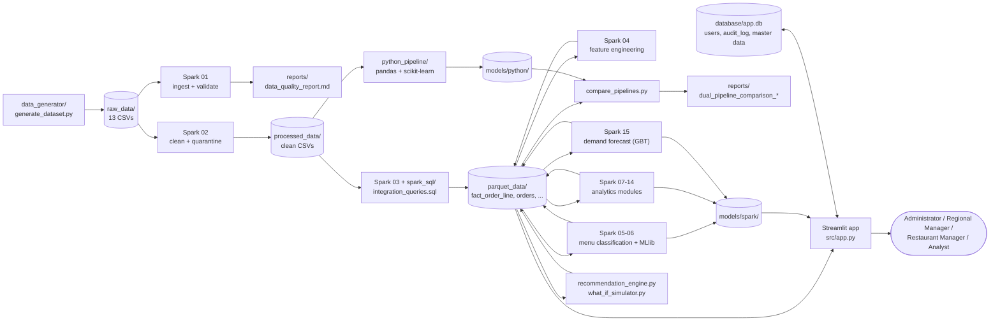
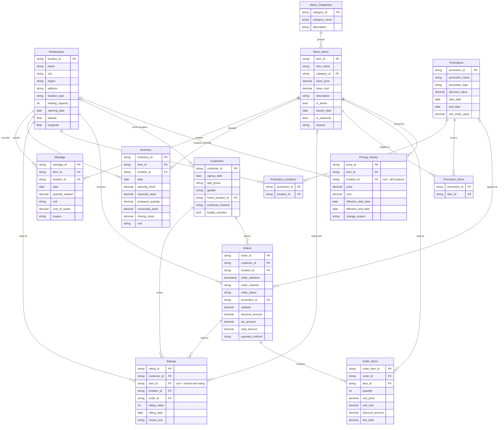
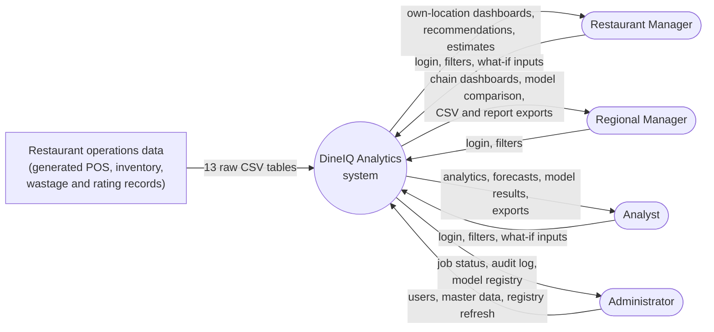
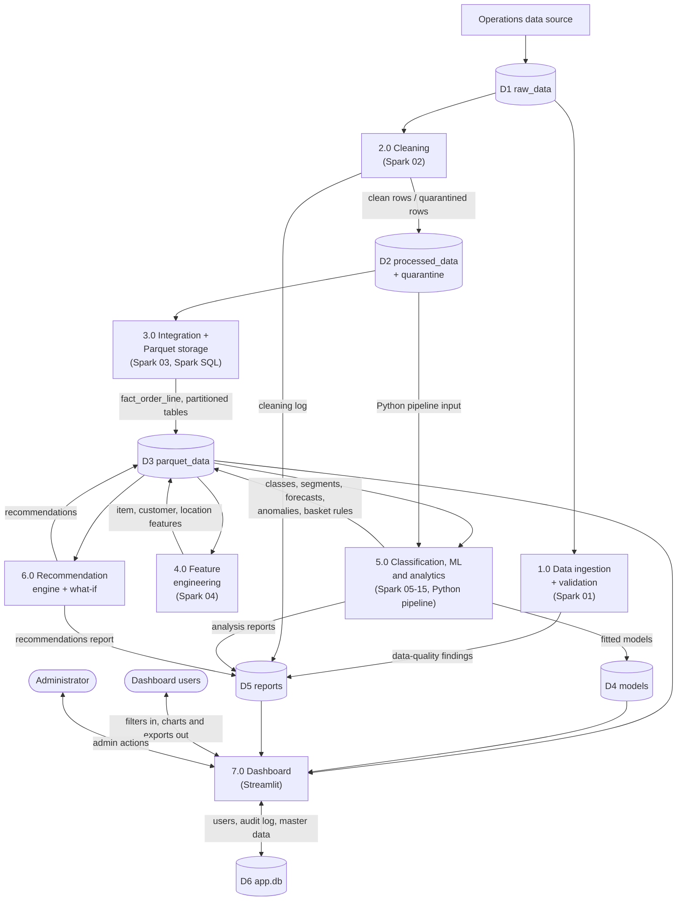
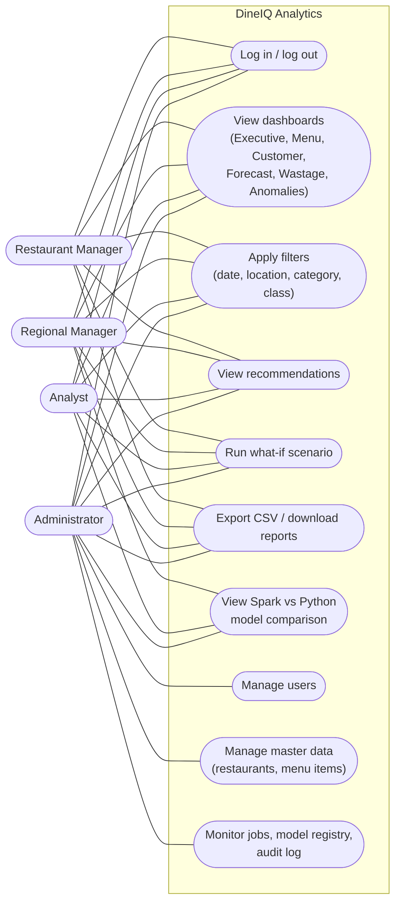
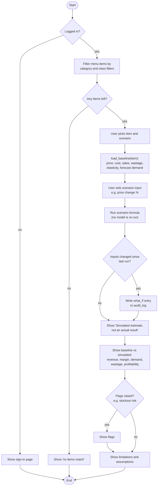
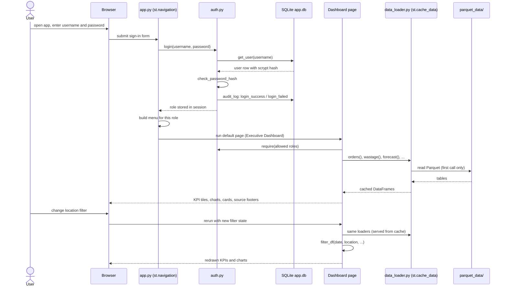

# DineIQ Analytics — Diagrams

All diagrams are Mermaid, so GitHub renders them in place. PNG renders for the report and slides are in `documentation/diagrams/`. Table and column names match `documentation/data_dictionary.md`. Process and file names match the code.

## 1. Architecture

## 2. Entity-relationship diagram (13 tables: 11 entities + 2 bridge tables)

## 3. Data-flow diagram, level 0

## 4. Data-flow diagram, level 1

## 5. Use-case diagram

Mermaid has no native use-case diagram, so this uses a flowchart: actors on the left, use cases inside the system boundary.

A Restaurant Manager's location filter is locked to their assigned restaurant.

## 6. Activity diagram: running a what-if scenario

Follows `src/pages/8_WhatIf_Simulator.py` and `python_pipeline/what_if_simulator.py`.

## 7. Sequence diagram: login, dashboard load, filter

