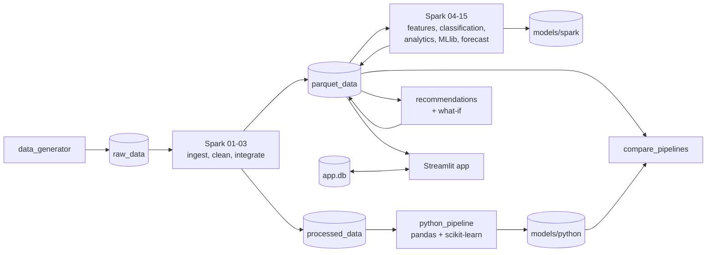

# DineIQ Analytics — Project Report

Techwiz 7, Data Science track. Repository: https://github.com/MuzammilAsif/DineIQ-DataScience

Every number in this report is taken from a generated file in `reports/`, and the file is named next to it. The build log with every decision is `documentation/dev_log.md`, and the diagrams are in `documentation/diagrams.md`.

---

## 1. Background

A multi-location restaurant chain produces a lot of operational data: every order and order line, the price in effect for each dish at each branch, promotions, customer ratings, daily inventory and daily wastage. Most chains look at it through a POS sales summary, which answers "how much did we sell" and little else. The questions a manager actually has are harder:

- Which dishes make money, and which only look busy?
- Which popular dishes throw away the most food?
- Did the last promotion bring in profit or just traffic?
- Which customers are about to stop ordering?
- How much of each dish will we need next week?

DineIQ is a chain of 25 restaurants in 11 Pakistani cities with 160 menu items in 14 categories. Prices are in PKR. The project builds the data platform and analytics that answer those questions.

## 2. Problem statement

Build an end-to-end restaurant intelligence system that:

1. ingests a large, deliberately dirty, multi-table operations dataset with Apache Spark;
2. measures and fixes its data-quality problems, with every rule written down and logged;
3. engineers item, customer and location features;
4. classifies menu items by profitability, demand, quality and wastage, and handles the difficult cases explicitly;
5. segments customers, finds basket associations, forecasts demand, predicts wastage risk, and analyses prices, promotions and anomalies;
6. trains Spark MLlib models and an independent Python (scikit-learn) pipeline, and compares them record by record;
7. turns the analytics into prioritised, evidence-backed recommendations and a what-if simulator;
8. serves all of it in a secure, role-based web dashboard.

## 3. Proposed solution

A two-pipeline system over a generated but realistic dataset:

- **Data generator** (`data_generator/`): 13 related tables for calendar year 2025, seeded (42) and scalable (`--scale`). It plants real business patterns and injects 28 kinds of data-quality issues, and logs every corrupted row.
- **Spark pipeline** (`spark_jobs/01`-`15`, `spark_sql/`):
  - explicit-schema ingestion, validation, cleaning with quarantine, and Spark SQL integration into a partitioned Parquet fact table;
  - feature engineering, rule-based menu classification, and an MLlib classifier;
  - eight analytics modules and a GBT demand forecaster.
- **Python pipeline** (`python_pipeline/`): pandas + scikit-learn. It recomputes the features from the cleaned CSVs and trains its own models. It never touches Spark code or Spark outputs.
- **Comparison** (`compare_pipelines.py`): agreement between Spark, Python and the actual label on unseen records.
- **Decision layer:** a recommendation engine (9 recommendation types, each with computed evidence and an impact-based priority) and a formula-based what-if simulator (7 scenarios).
- **Web app** (`src/`): Streamlit, with login (hashed passwords), four roles, global filters, 10 pages, CSV and report export, an audit log and admin screens.

## 4. Scope and constraints

**In scope:** everything in section 2, over one year of data for one chain. The app runs locally; the README has the full install and run instructions.

**Constraints:**
- **Hardware.** Development ran on a 4-core, 8 GB VM with Spark in local mode. Spark's driver is capped at 4 GB. The full Spark test suite must run with nothing else heavy open.
- **No real data.** Real restaurant transaction data with costs, wastage and ratings is not public. The dataset is generated, and every planted pattern is documented (dev log, Step 1) so the analytics can be checked against known ground truth.
- **Time.** The work was compressed into a few days. Section 11 lists every place where scope was reduced.
- **Integrity.** No number shown in the app or in a report is typed in by hand. Every dashboard section shows the file it reads and when that file was written.

## 5. Architecture

The full set of diagrams is in `documentation/diagrams.md`:
- detailed architecture
- ERD of all 13 tables with PKs and FKs
- DFD level 0 and level 1
- use-case diagram for the four roles
- activity diagram of a what-if run
- sequence diagram of login, dashboard load and filtering

**Technology stack**

| Layer | Technology |
|---|---|
| Language | Python 3.14 |
| Big data processing | Apache Spark 4.2 (PySpark), Spark SQL, local mode |
| Storage | CSV (raw, cleaned), Parquet partitioned by year/month and `as_of_date`, JSON (storage-format demo), SQLite (app state) |
| Spark ML | Spark MLlib: LogisticRegression, DecisionTree, RandomForest, KMeans, FPGrowth, GBTRegressor, CrossValidator |
| Python ML | pandas 3, scikit-learn 1.9, joblib |
| EDA | Jupyter, matplotlib |
| Web app | Streamlit 1.64, Plotly, Werkzeug (scrypt password hashing) |
| Testing | pytest, Streamlit AppTest, Playwright (screenshots) |
| Config | YAML threshold files in `config/` |

## 6. Methodology

### 6.1 Dataset generation

`data_generator/generate_dataset.py` builds the 13 tables in foreign-key order: Restaurants, Menu_Categories, Menu_Items, Pricing_History, Customers, Promotions, Promotion_Items, Promotion_Locations, Orders, Order_Items, Ratings, Inventory and Wastage. At scale 1.0 (seed 42) that is 196,547 orders, 1,070,114 order lines, 105,000 ratings, 1,251,246 inventory rows and 60,290 wastage rows (`reports/data_quality_report.md`). Scale 5 produced about 5.3M order lines in 88 s.

Patterns were planted but not labelled, so the analytics had to find them:
- Fri–Sun weekends and 12–14 / 19–22 peaks, with Ramadan shifting orders to the evening
- seasonal items, about 8% growth over the year, and a 4.5x volume spread between locations
- six customer archetypes
- five item archetypes: high-volume/low-margin, high-margin/low-volume, high-wastage popular, poorly rated, and promotion-dependent
- a promotion trap (PROMO012 "August BOGO Blast")
- mid-year price rises and cuts with a demand response

On the clean build (`--clean`), four consistency checks pass with zero violations: order totals against lines, line prices against Pricing_History, the inventory balance equation, and wastage never exceeding prepared quantity.

Dirty data was then injected: 28 rules across 8 tables. They cover missing values, orphan foreign keys, invalid and out-of-range dates, invalid prices, negative quantities, out-of-range ratings, duplicate rows, discounts larger than the subtotal, inconsistent units and wastage larger than prepared quantity. Every corrupted row is logged in `reports/dirty_injection_log.csv`.

### 6.2 Data quality and cleaning

`spark_jobs/01_ingest_and_validate.py`:
- loads every table with an explicit `StructType` (`spark_jobs/schemas.py`), and shows schema inference side by side for comparison;
- checks data types by diffing a typed load against a raw all-string load;
- demonstrates multi-file ingestion: Order_Items for a month is written partitioned and read back as one DataFrame from 39 part files;
- counts orphan foreign keys with left-anti joins.

The findings are in `reports/data_quality_report.md`. The detected counts match the injected counts on the raw data almost exactly. The report's cross-check section explains the three small gaps, including 8,262 cancelled orders (4.2%), which are real business data, not defects.

The cleaning rules were written before the code, in `documentation/data_quality_rules.md`. `02_clean.py` then:
- removes duplicates;
- corrects prices from Pricing_History;
- normalises units (`kgs`, `Pcs`, `Liters`, ... to kg / pcs / l);
- quarantines everything else, with a reason, to `processed_data/quarantine/`.

Quarantine cascades along foreign keys: a quarantined customer makes their orders orphans too.

| Table | Before | After | Removed |
|---|---|---|---|
| Customers | 55,000 | 54,450 | 550 |
| Orders | 196,547 | 187,228 | 9,319 |
| Order_Items | 1,070,114 | 1,002,824 | 67,290 |
| Ratings | 105,000 | 97,121 | 7,879 |
| Inventory | 1,251,246 | 1,247,492 | 3,754 |
| Wastage | 60,290 | 58,787 | 1,503 |

Source: `reports/cleaning_row_counts.csv`.

### 6.3 Spark pipeline and Spark SQL

`spark_sql/integration_queries.sql` holds the 10 required joins and the `fact_order_line` query, the base fact table at order-line grain. `03_integrate_and_store.py` registers the cleaned tables as views and runs the queries. It writes `fact_order_line` to Parquet partitioned by `order_year`/`order_month`, and Orders, Order_Items, Inventory and Wastage partitioned by year/month. Two small tables are also written as JSON to demonstrate a second storage format.

Every job logs each stage and its duration to `reports/spark_execution_log_<job>.txt`, and the Admin page shows those logs.

Engineering problems found and fixed during the build:
- a global `HADOOP_CONF_DIR` pointing at a stopped HDFS namenode, fixed by pinning `fs.defaultFS=file:///`;
- an `.isin()` orphan check that stalled the driver, rewritten as a join;
- missing caches that made the cleaning job recompute its lineage, which had taken over 10 minutes;
- timestamps written in ISO format that came back null on reload, fixed by pinning the write format.

### 6.4 Feature engineering

`04_feature_engineering.py` computes item, customer and location features as of a chosen date. It uses only records dated on or before `as_of_date`, including the whole of that day. Snapshots exist for 2025-12-31 and 2025-09-30.

| Level | Features |
|---|---|
| Item | revenue, cost, contribution margin, profit %, quantity sold, popularity, order frequency, repeat-purchase rate, average rating, rating trend, wastage %, promotion dependency, discount %, price change %, weekend order ratio, sales trend |
| Customer | recency, frequency, monetary value, average order value, channel preference and others |
| Location | revenue, orders, customers, basket size, peak share and others |

Two decisions matter:
- **Wastage units.** Wasted quantity is in kg, litres or pieces and sales are in portions, so wastage is converted to portions through cost.
- **Ratios** are stored as fractions (0–1), except profit % and price change %.

The EDA notebook (`notebooks/01_eda.ipynb`) writes `reports/eda_report.md`. Its headline numbers:
- net revenue 1,200.4M PKR at a 56.5% gross margin
- 179,324 completed orders from 49,606 customers
- wastage cost 28.5M PKR (2.4% of revenue)

### 6.5 Menu profitability and classification

`05_menu_classification.py` ranks each active item on four percentiles: profitability, demand, quality and wastage. It sorts each percentile into Low / Medium / High tiers at 0.33 and 0.67. It then assigns one of five classes (Profit Driver, Volume Driver, Hidden Opportunity, Low Performer, Insufficient History) and ten flags for the difficult cases.

Every threshold is in `config/classification_thresholds.yaml`. Tests prove that editing the file changes the output without a code change. The rules also cover:
- **New items** (under 90 days since launch) are Insufficient History whatever their numbers, and are left out of the ranking so they don't shift anyone else's percentile.
- **Per-location classification** is a second run with percentiles partitioned by location.

### 6.6 Customer segmentation and RFM

`07_customer_segmentation.py` computes RFM quintiles with `ntile(5)` (score 3–15). It fits Spark MLlib KMeans (k=6) on standardised recency, log frequency, log monetary value, average order value and promotion order share. Each cluster gets one label by ranking the cluster means.

Fixed cutoffs were tried first and failed: most customers order once or twice, so "recency > 90 days" labelled four of six clusters At-Risk. One customer in five, chosen by `crc32(customer_id) % 5`, is held out of fitting for the dual-pipeline comparison.

### 6.7 Market-basket analysis

`08_market_basket.py` runs Spark MLlib FPGrowth over completed orders. The planned thresholds (support 0.01, confidence 0.3) gave no rules, because the highest pair confidence in the data is 0.20. They were lowered to 0.005 / 0.1. Only rules with lift of at least 1.2 are called bundle candidates.

### 6.8 Demand forecasting

`15_demand_forecasting.py` trains one MLlib GBTRegressor at item × location × day grain over the days each item was stocked, so a stocked day with no sales is a real zero.

- **History features:** lags 1, 7 and 14 and rolling means over 7 and 14 days, joined on exact calendar offsets. A gap drops the row rather than borrowing a neighbouring day.
- **Target-date features:** calendar, promotion and price, which are known in advance.
- **Horizon:** 7 days.
- **Split:** chronological. Training targets run to 2025-11-16; the test period is 2025-11-17 to 2025-12-31.
- **Baseline:** same weekday last week.

Forecasts are rolled up to item, category, location and chain level.

### 6.9 Wastage analysis and risk prediction

`09_wastage_analysis.py` reports wastage cost and a cost-based wastage rate, wastage cost / (wastage cost + COGS), by item, category, location, reason and promotion status. It trains a Spark RandomForest to flag high-risk item-location-days, labelled as wasted / prepared > 10%.

A top-quartile label was not usable: 95% of item-days have no waste. The split is time-based (test from 2025-10-01), and the day's waste, consumption and closing stock are excluded as leakage. A test checks this.

### 6.10 Price intelligence

`10_price_intelligence.py` evaluates each chain-wide price change of at least 5% that has a full 30-day window on both sides. Demand change is divided by the same-window change in the rest of the item's category, which removes shared seasonality. Elasticity is the adjusted demand change over the price change.

A zero or positive elasticity is labelled Inconclusive instead of being forced into a class. Negative elasticities are split into Highly, Moderately and Low sensitivity by percentile. Without the control and the sign rule, seasonal items (haleem, pakoras, lassi) came out as the most price-sensitive.

### 6.11 Promotion analysis

`11_promotion_analysis.py` measures each promotion on its own items at its own locations over three equal windows: before, during and after. A promotion is a trap if any of these hold:
- revenue or orders rise but total margin falls;
- customers rise but margin per order falls by more than 5%;
- wastage rises by more than 10%;
- post-promotion quantity falls more than 5% below the pre-promotion level.

### 6.12 Anomaly detection

`12_anomaly_detection.py` flags anything more than 3 standard deviations from the series' own recent past, with the current period excluded from the baseline:
- rolling z-scores on weekly item ratings (count and average), against the previous 8 weeks;
- rolling z-scores on daily sales per item and per location, against the previous 28 days;
- orders above Q3 + 3 × IQR of total amount;
- weeks where one rating value is at least 80% of an item's ratings;
- duplicate transactions.

### 6.13 Spark MLlib model design

`06_menu_classification_model.py` predicts the rule-based menu class from the 16 raw item metrics. The four percentiles, tiers, quality score, flags and the class itself are excluded, and a test asserts that none of them reaches the feature vector.

- **Data:** Insufficient History items are dropped, leaving 150. A stratified 80/20 split (`sampleBy`, seed 42) holds out 28 items.
- **Tuning:** Logistic Regression, Decision Tree and Random Forest are each tuned by 5-fold CrossValidator.
  - The folds are dealt per class, so every fold holds every class.
  - Class weights are balanced.
  - A custom evaluator tunes on macro F1, because Spark's built-in "f1" is weighted.
- **Selection:** the final model is picked on held-out macro F1 and saved with a `model_version.txt`.

GBTClassifier was left out because Spark's GBT is binary-only.

The same MLlib approach was used for the wastage-risk RandomForest, the KMeans segmentation, FPGrowth and the GBT forecaster.

### 6.14 Python model design

`python_pipeline/` is a separate implementation:
- **Features:** `features.py` recomputes the item and customer features in pandas from `processed_data/`.
- **Segmentation:** scikit-learn KMeans (k=6, k-means++, 10 restarts) on the same five inputs.
- **Menu classification:** scikit-learn LR, DT and RF, with the same grids, balanced weights and 5-fold stratified CV as Spark.
- **Regularisation mapping:** Spark `regParam` is mapped to `C = 1 / (regParam × n_train)`.

The pipeline shares only three things with Spark: the target label, the 28 held-out item IDs and the config file. It shares no features and no results. AST-based tests check that it imports nothing from `spark_jobs/` and reads no Spark output.

### 6.15 Dual-pipeline comparison

`compare_pipelines.py` compares the two pipelines on unseen records:
- **Customers:** 9,899 holdout customers. The "Actual" segment is a documented business rule (`segment_rules.py`).
- **Menu items:** the 28 held-out items.

Each record gets both predictions, both confidences, a Match/Mismatch flag and a consistency status (both correct, both wrong, only Spark correct, only Python correct). The report explains each disagreement pattern with numbers.

### 6.16 Recommendation engine and what-if simulator

`recommendation_engine.py` reads the Step 4–8 outputs and produces nine recommendation types:
- promote Hidden Opportunity
- increase stock before a forecast peak
- reduce prep of a high-wastage dish
- remove or redesign a persistent Low Performer
- review an ineffective promotion
- review the pricing of a price-sensitive dish
- target a customer segment
- investigate an anomalous location
- create a bundle

Every recommendation has at least two evidence lines with computed values, an estimated impact and its basis. Priority is the rank of the impact across all recommendations: top 10% Critical, next 20% High, next 40% Medium, the rest Low.

`what_if_simulator.py` implements seven scenarios as pure functions over an item's current metrics:
- price change
- discount change
- promotion frequency
- remove item
- reduce prep
- demand change
- wastage assumption

It uses the item's measured elasticity where one exists, and a config default where it doesn't. Every result is labelled "Simulated estimate, not an actual result".

## 7. Results

### 7.1 Menu classification (`reports/menu_classification_report.md`)

156 active items as of 2025-12-31: Profit Driver 12, Volume Driver 38, Hidden Opportunity 43, Low Performer 57, Insufficient History 6.

Flags raised:

| Flag | Items |
|---|---|
| Rarely purchased, high margin | 19 |
| Excessive wastage | 35 |
| Location inconsistent | 48 |
| Seasonal item | 22 |
| Promotion dependent | 5 |
| Low rating, high sales | 1 |
| Weekend skewed | 1 |
| Loss making | 0 |
| High rating, low profit | 0 |

The two zero flags are real gaps in the data, not missing code. The lowest contribution margin is +343,058 PKR (Tandoori Roti), and the highest average rating is 4.27, under the 4.3 threshold. Synthetic tests cover both rules.

**Difficult cases, as they came out in the real data:**
- **High-selling but low-margin: Chicken Tikka Pizza (Medium).** It sold 35,362 units (demand percentile 0.95) at a 29.5% margin, the second-lowest on the menu (`reports/eda_report.md`, section 1.5). It is a **Volume Driver**, not a Profit Driver: Profit Driver needs high profitability, and its profitability percentile is near zero, even though its absolute contribution is large.
- **Low-selling but high-margin: Cafe Latte.** 85.8% margin with demand percentile 0.11, so it is a **Hidden Opportunity**.
- **Popular but wasteful: Seekh Kabab.** Demand percentile 0.90 and profitability percentile 0.80 would make it a Profit Driver, but 19.5% wastage demotes it to Volume Driver.
- **Poorly rated but profitable: Mutton Pulao.** Rated 2.21 (demand percentile 0.72), yet still a Profit Driver. It is also location-inconsistent: its class differs from the chain-wide one at 72.7% of the 22 locations that sell it.
- **New item: Kunafa Cheesecake.** Launched 2025-12-01, 30 days before the snapshot, so it is Insufficient History.

### 7.2 Spark MLlib classifier (`reports/spark_mllib_menu_classification_report.md`)

| Model | CV macro F1 | Test accuracy | Test macro F1 |
|---|---|---|---|
| Logistic Regression (regParam 0.01) | 0.707 | 0.821 | 0.812 |
| Decision Tree (maxDepth 3) | 0.884 | 0.786 | 0.798 |
| **Random Forest (30 trees, depth 10)**, final | 0.822 | **0.929** | **0.914** |

The final model meets both targets (accuracy ≥ 0.85 and macro F1 ≥ 0.80) on 28 held-out items. The report states the caveats:
- Every test class has fewer than 10 items.
- Choosing the winner on the test set makes its score optimistic.
- The label is a percentile function of features that are also inputs, so high scores are expected.

### 7.3 Customer segmentation (`reports/restaurant_intelligence_report.md`, section 1)

49,606 customers:

| Segment | Customers |
|---|---|
| New | 10,872 |
| Frequent | 9,637 |
| Promotion-Driven | 8,870 |
| At-Risk | 8,443 |
| High-Value Loyal | 6,502 |
| Occasional | 5,282 |

High-Value Loyal customers average 12.3 orders and 107,760 PKR spend with 22 days' recency. Promotion-Driven customers used a promotion on 88% of their orders.

Churn risk (section 8) flags 7,893 customers (15.9%), using recency over 115 days (2 × the 57.4-day average gap) plus a quarter-on-quarter decline in orders.

### 7.4 Market basket (section 2)

FPGrowth found 586 frequent itemsets and 449 rules over 179,283 completed orders. The highest lift is 1.48 (Aloo Pakora → Chicken Pakora). Only 4 of the top 20 rules reach the 1.2 bundle threshold, so associations in this data are weak, and the report says so.

### 7.5 Demand forecast (`reports/forecast_report.md`)

| Level | Baseline MAE | Model MAE | Baseline RMSE | Model RMSE | Baseline MAPE | Model MAPE | Model R² |
|---|---|---|---|---|---|---|---|
| item × location × day | 1.59 | 1.35 | 2.79 | 2.14 | 92.7% | 59.3% | 0.474 |
| item × day | 10.70 | 8.40 | 17.75 | 13.02 | 55.3% | 64.1% | 0.917 |
| category × day | 74.28 | 51.63 | 118.54 | 76.25 | 19.1% | 18.3% | 0.934 |
| location × day | 67.64 | 51.24 | 87.48 | 65.78 | 38.6% | 34.4% | 0.621 |
| chain × day | 927.56 | 512.01 | 1,226.09 | 666.69 | 16.6% | 10.5% | 0.805 |

The model beats the baseline on MAE and RMSE at every level: at the base grain, MAE is -14.8% and RMSE -23.2%. It loses on item-day MAPE (64.1% vs 55.3%) because item-days with 1–5 units are always over-forecast. From 21 units a day up, the model wins (22.0% vs 32.2%). The median percentage error also favours the model (24.7% vs 33.3%).

### 7.6 Wastage (section 3)

Karahi & Handi alone wastes 16.3M PKR. Its top three items (Mutton Karahi (Half), Chicken Karahi (Half), Chicken Handi) each waste about 19–20% of cost.

The wastage-risk RandomForest was tested on 318,056 item-days (4.2% positive):

| Accuracy | Precision | Recall | F1 | ROC AUC | PR AUC |
|---|---|---|---|---|---|
| 0.913 | 0.228 | 0.455 | 0.304 | 0.763 | 0.229 |

Item-level features carry 84% of the importance. The model is useful for ranking item-location pairs to watch, not for day-by-day prep decisions.

### 7.7 Price sensitivity (section 4)

Of 284 chain-wide price changes, 120 were evaluable. Results by item: 13 Highly, 15 Moderately and 15 Low sensitivity, 53 Inconclusive and 60 Not Evaluated. The most sensitive item is Double Patty Burger: a +6.7% price rise cut demand by 60.6% (elasticity −9.11).

### 7.8 Promotions (section 5)

15 of 20 promotions are flagged. 7 of those are flagged only for wastage, which is a weak signal on its own, because kitchens over-prepare for every promotion. PROMO012 August BOGO Blast is the planted trap:
- orders on its items +87% (6,808 → 12,738) and customers +71%;
- margin rate down from 60.9% to 47.0%, and margin per order from 1,805 to 1,455 PKR;
- wastage cost up from 1,065,456 to 5,839,932 PKR.

### 7.9 Anomalies (section 6)

| Anomaly type | Flags |
|---|---|
| Item daily-quantity z-scores | 894 |
| Item daily-revenue z-scores | 869 |
| High-value orders (above 27,365 PKR) | 688 |
| Rating-count z-scores | 307 |
| Average-rating z-scores | 238 |
| Location daily-revenue z-scores | 132 |
| Location daily-order z-scores | 122 |
| Identical-rating weeks | 19 |

No duplicate transactions were found. The busiest flag dates are promotion launches (PROMO012 on 1–2 August) and holidays.

### 7.10 Dual-pipeline comparison (`reports/dual_pipeline_comparison_report.md`)

| Task | Records | Spark vs Actual | Python vs Actual | Spark vs Python |
|---|---|---|---|---|
| Customer segmentation (holdout) | 9,899 | 64.0% | 64.7% | 98.9% |
| Menu classification (RF, held-out) | 28 | 92.9% | 92.9% | 100.0% |
| Both | 9,927 | 64.0% | 64.8% | 98.9% |

- **Features:** Python and Spark agree on every item and customer feature. The largest difference is 1.5e-6 in item cost sums, with zero null mismatches.
- **Clusterings:** the adjusted Rand index between the two customer clusterings is 0.969.
- **Disagreements:** 113 of the 9,899 customers are inconsistent. Where the pipelines disagree, the customer sits on a cluster boundary: the median gap to the second-nearest centroid is 0.04, against 0.87 where they agree.
- **Agreement with Actual:** about 64%, because no cluster on either side maps to New or Frequent. New depends on signup date, which is not a clustering input. This measures how well unsupervised clusters line up with a business rule; it is not a supervised accuracy.

### 7.11 Recommendations (`reports/recommendations_report.md`)

208 recommendations: 20 Critical, 43 High, 82 Medium, 63 Low. One example, in the SRS format:

> **REC-009: Review promotion PROMO012 (August BOGO Blast) before running it again**
>
> Reason:
> - Trap flags: customers_up_margin_per_order_down, wastage_up
> - Orders 6,808 to 12,738; margin rate 60.9% to 47.0%
> - Margin per order PKR 1,805 to PKR 1,455
> - Wastage cost PKR 1,065,456 to PKR 5,839,932
> - Post-promotion quantity -3% vs before
>
> Priority: Critical. Estimated impact: 9,239,998 (margin given up + extra wastage in the promotion window).

## 8. Web application

`src/app.py` uses `st.navigation`, grouped into four sections:

| Section | Pages |
|---|---|
| Overview | Executive Dashboard |
| Intelligence | Menu Intelligence, Customer Intelligence, Demand Forecast, Wastage |
| Decisions & Actions | Anomalies, Recommendations, What-If Simulator |
| Platform | Model Comparison, Admin |

Features:
- A filter bar on every page (date range, location, menu category, performance class) that persists across pages. Each section states which filters it applies.
- KPI tiles, Plotly charts with units and hover values, priority badges and evidence cards.
- A source footer under every section, naming the file it reads and that file's last-modified time.
- CSV download under every table, and download of any `reports/*.md`.
- Admin (Administrator only): job monitoring from the Spark logs, the model registry, the audit log, user management, and master-data editing for Restaurants and Menu Items.

Screenshots of every page are in `screenshots/`.

## 9. Testing strategy

`tests/` has 135 pytest tests across 13 files. The last full run is in `reports/test_results.txt`.

| Area | File | What it checks |
|---|---|---|
| Schema | `test_schema.py` | 13 declared schemas; loaded schema matches |
| Data quality | `test_data_quality.py` | Injected issues are detected; counts match the injection log |
| Cleaning | `test_cleaning.py` | No negative quantities, invalid ratings or prices, bad discounts, orphans or duplicates; units normalised; wastage ≤ prepared |
| Integration | `test_joins.py`, `test_parquet_roundtrip.py` | Fact-table grain and row count; Parquet round trip |
| Features | `test_feature_engineering.py` | Every feature on a hand-computed dataset, as-of cutoffs, division by zero, peak-hour boundaries |
| Classification | `test_menu_classification.py` | Every class and difficult case, new-item cutoff, config edits flipping a class |
| MLlib model | `test_menu_classification_model.py` | End-to-end run, leakage, macro F1 by hand, save/reload |
| Analytics | `test_analytics.py` | Segmentation, RFM, FPGrowth metrics, wastage leakage, elasticity, price classes, promotion traps, sales and rating anomalies, slow movers, churn |
| Forecast | `test_demand_forecasting.py` | Exact lags, horizon shift, chronological split, metrics |
| Python pipeline | `test_python_pipeline.py` | No Spark imports or Spark outputs (AST), feature spot-check, agreement %, segment rules, holdout parity |
| Recommendations | `test_recommendations_whatif.py` | Evidence on every recommendation, priority buckets, one hand-computed test per what-if scenario |
| Web app | `test_app.py` | Hashed passwords, login success/failure with audit, role gating, pages stop before login, loaders, anomaly severity |

**The SRS difficult cases, each with a direct test:**

| Case | Test |
|---|---|
| High-selling, loss-making dish | `test_high_selling_loss_making_is_volume_driver` |
| Low-selling, high-margin dish | `test_highly_profitable_rarely_purchased` |
| High-wastage popular dish | `test_popular_dish_with_excessive_wastage_loses_profit_driver` |
| Promotion raising sales but cutting profit | `test_promotion_trap_flags` |
| Dish performing differently across locations | `test_location_inconsistent` |
| New menu item | `test_new_item_is_insufficient_history_regardless_of_numbers` |
| Price-sensitive item | `test_price_sensitive_item_classes`, `test_elasticity_before_after_with_category_control` |
| Customer churn | `test_churn_rule` |
| Rating anomaly | `test_rating_anomaly_flags_rating_drop_and_identical_week` |
| Sales anomaly | `test_rolling_z_flags_spike_only` |
| Spark/Python disagreement | `test_agreement_percentage_hand_example` |

## 10. Security and privacy

- **Authentication:** passwords are stored only as Werkzeug scrypt hashes, and a test checks that no plain password is stored. Every login attempt, successful or not, is written to the audit log.
- **Role-based access:**
  - Four roles.
  - Every page calls `auth.require(roles)` before rendering, so a page opened by URL is still stopped.
  - The menu shows only the pages a role may open.
  - Admin is Administrator-only.
  - A Restaurant Manager's location filter is locked to their own restaurant.
- **Audit log:** records logins, logouts, CSV and report exports, what-if runs and every admin action, with the user and a timestamp.
- **Anonymised data:**
  - Customers are identified only by a surrogate ID, with age group, gender, home location, preferred channel and loyalty flag.
  - There are no names, phone numbers, emails or addresses.
  - The whole dataset is synthetic.
- **Errors:** `showErrorDetails = false`, and a `guard()` wrapper shows a plain message instead of a stack trace.
- **SQL:** SQLite queries use parameters. The table names in the master-data screens come from a fixed whitelist.

## 11. Limitations

Scope reductions and known weaknesses, stated plainly:

**Data**
- The dataset is synthetic. The patterns are planted, so the analytics find what the generator put in. That is useful for verification but is not evidence about real restaurants.
- Promotions are not tied to order channels; for example, an "App Exclusive" promotion can apply to dine-in orders.
- Two classification flags (`loss_making`, `high_rating_low_profit`) never fire on the generated data. Synthetic tests cover them.

**Modelling**
- The MLlib menu classifier is scored on 28 held-out items, with fewer than 10 per class. The winner was chosen on the test set, and its label is a function of its own inputs.
- The wastage-risk model, the GBT forecaster and KMeans each use **one algorithm**. The three-algorithm comparison was done only for menu classification.
- The wastage-risk model mostly learns item identity (84% of importance). PR AUC is 0.229 against a 4.2% base rate.
- Item-day forecast MAPE is worse than the baseline's, and MAPE at the base grain excludes the 52% of rows with zero actuals.
- Segment labels come from ranking cluster means, not from ground truth. Agreement with the rule-based Actual is about 64%.
- Market-basket associations are weak (maximum lift 1.48), and the thresholds were lowered to get any rules.
- Price elasticity is a before/after comparison with a category control. It does not control for item-specific seasonality or promotions.
- Churn is a rule, not a model, and cannot flag customers who stopped before the previous quarter.
- Anomaly detection is purely statistical, with no labelled set to measure precision. Holidays and promotion launches are flagged along with real anomalies.
- Anomaly severity in the app (Critical / High / Medium) is a fixed rule on |z| (6+, 4.5+, 3+). High-value orders and identical-rating weeks are marked "Review" because they have no z-score.
- Recommendation priorities rank impact proxies in different units. Segment spend dwarfs an item's wastage, so all 6 segment recommendations rank Critical.

**Application**
- Master-data CRUD covers **Restaurants and Menu Items only**. Promotions, Pricing, Customers, Orders, Ratings, Inventory and Wastage have no edit screens; they are pipeline-managed. Edits are stored in `app.db` and reach the dashboards only through a pipeline run.
- Not built as pages: Basket & Bundles (the rules are in the intelligence report and appear as bundle recommendations), Pricing & Promotions (results are in the intelligence report and appear as recommendations), and a separate Reports & Export page (downloads live on the Executive Dashboard and under each table).
- There is no channel filter in the global filter bar.
- The app is not deployed to a public URL; the local install instructions stand in for it.
- The first load of the Executive Dashboard takes about 10 seconds while it reads the full fact table.

## 12. Future enhancements

- Pricing & Promotions and Basket & Bundles pages, and a channel filter.
- CRUD screens for Promotions and Pricing, with edits feeding a pipeline rerun.
- A three-algorithm comparison for wastage risk and forecasting, and a day-level wastage model that uses the forecast as input.
- Month-aware peak windows (Ramadan) and holiday features in the forecaster.
- Anomaly review workflow (New / Reviewing / Resolved / Dismissed) logged to the audit table.
- Scheduled pipeline runs, and deployment to Streamlit Community Cloud or a container.
- Real-data validation with a partner restaurant.

## 13. Conclusion

DineIQ turns a million-row, deliberately dirty dataset into decisions a restaurant manager can act on. Spark handles ingestion, cleaning, integration and most of the modelling. An independent Python pipeline reproduces the features exactly and agrees with Spark on 98.9% of unseen records. Every recommendation carries the numbers behind it, and every dashboard section names its source file. The limitations above are real, and they are written down rather than hidden.

---

## Appendix A. Where each deliverable is

| Deliverable | Location |
|---|---|
| Source code | `data_generator/`, `spark_jobs/`, `spark_sql/`, `python_pipeline/`, `src/` |
| Dataset + generation scripts | `raw_data/`, `data_generator/`, samples in `sample_data/` |
| Data dictionary | `documentation/data_dictionary.md` |
| Cleaning rules | `documentation/data_quality_rules.md` |
| Parquet datasets | `parquet_data/` |
| Spark MLlib models | `models/spark/` |
| Python models | `models/python/` |
| Model registry | `models/model_registry.json` |
| Data-quality report | `reports/data_quality_report.md` |
| EDA report | `reports/eda_report.md` |
| Restaurant Intelligence report | `reports/restaurant_intelligence_report.md` |
| Dual-pipeline comparison report | `reports/dual_pipeline_comparison_report.md`, `.csv` |
| Forecast report | `reports/forecast_report.md` |
| Recommendations report | `reports/recommendations_report.md` |
| Test cases + results | `tests/`, `reports/test_results.txt` |
| Install + execution instructions | `README.md` |
| Diagrams | `documentation/diagrams.md` |
| Technical blog | `documentation/technical_blog.md` |
| Screenshots | `screenshots/` |
